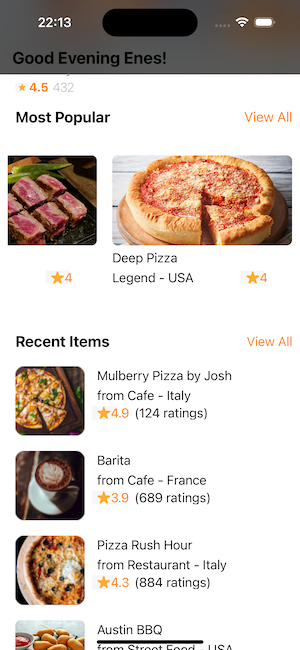

# CuisineAppUI

## Description

Cuisine App is an iOS mobile application developed during the Pazarama iOS Bootcamp. This app provides a user-friendly interface to explore various cuisines, popular restaurants, and recent items. It uses a combination of UITableView and UICollectionView, all designed programmatically in Swift.

##Features

Cuisine Exploration: Discover a wide variety of cuisines from around the world.
Popular Restaurants: Browse and find popular restaurants, view their ratings, and read comments.
Recent Items: Check out recent food items, see their ratings, and get information about the restaurants they belong to.

## Screenshot
              

    

## Gif

